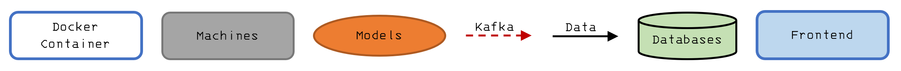
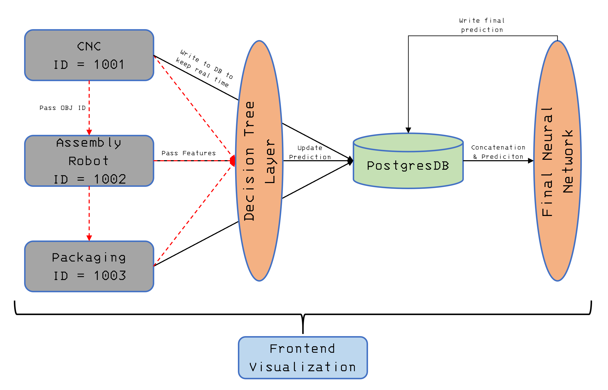
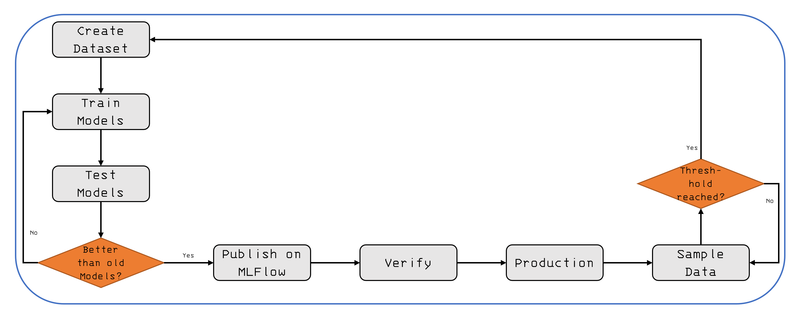

# ProductionLineSimulation
This project simulates a production line environment with multiple virtual machines (e.g., sensors, equipment) that continuously emit data streams. These data streams are processed in real time using containerized machine learning models to predict the quality of produced parts. The system includes a live monitoring dashboard and is fully orchestrated using Docker.

# Table of Content
- [Setup](#setup)
- [Architecture](#architecture)
    - [Symbol Explanation](#symbol-explanation)
    - [Process Diagram](#process-diagram)
    - [Training Pipeline](#training-pipeline)
- [Contact](#contact)

# Setup
1. Pull the repository from github
```
git clone https://github.com/digital-business-lab/ProductionLineSimulation.git
```

2. Build and start the docker container (Docker Desktop has to run while doing this)
```
docker compose up -d --build
```

3. Open the frontend add localhost:5000

4. Start a machine or stop the machine by clicking the buttons. You can controll if its running by opening Grafana (localhost:3000) and look at the dashboard (Dashboards -> Postgres Table View). 

5. After you finished your work you can shut down the container by doing "docker compose down". If you want to restart it do "docker compose up -d". For restart and rebuild do step 2.

If machines do not work as intended you can look at the logs by doing "docker compose logs container-name"

# Architecture
The architecture strongly depends on docker and everything from the database till the machines runs in a docker container which communicate between each other.

## Symbol Explanation


## Process Diagram


## Training Pipeline


# Technologies
| **Technologies** | **Description**                                                                 | **Running**                             |
|------------------|----------------------------------------------------------------------------------|------------------------------------------|
| Docker           | Platform for containerizing applications to ensure consistency across environments | Host runtime (manages all containers)    |
| Kafka            | Distributed event streaming platform used for building real-time data pipelines and streaming apps | Docker container                        |
| Flask            | Lightweight Python web framework for building web APIs and applications         | Docker container                        |
| PostgreSQL       | Open-source relational database system known for reliability and performance     | Docker container                        |
| Grafana          | Visualization tool for monitoring and analyzing metrics from various data sources | Docker container                        |

# Contact
If you have any problems running the program or you find bugs, feel free to contact l.graf@oth-aw.de.